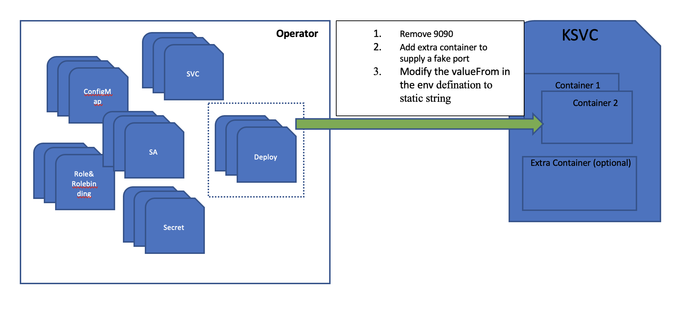
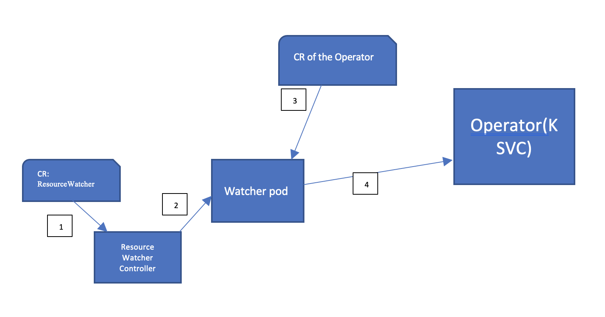

# Resource-watcher

The project is used for watching on resources of k8s,
when anything changed on the watched resource (add, update, delete) will take action:
- Send `Cloudevent` to specific `url`
- Create k8s event
- TODO

The `action` should be pluginable, user could implements what they want, for example: send mail...

It's k8s native and implements by a k8s controller.


## Development Prerequisites
1. [`go`](https://golang.org/doc/install): The language Tektoncd-pipeline-operator is
   built in
1. [`git`](https://help.github.com/articles/set-up-git/): For source control
1. [`kubectl`](https://kubernetes.io/docs/tasks/tools/install-kubectl/): For
   interacting with your kube cluster
1. operator-sdk: https://github.com/operator-framework/operator-sdk
1. [ko](Option)(https://github.com/google/ko): Build and deploy Go applications on Kubernetes (optional)

# Details
The project implements `Controller/reconciler` based on `operator-sdk` and enhance it to use `ko` as build/deploy tool.

# Basic idea
### Wrapper Operator to KSVC


### Whole process

1. Create CR: `ResourceWatcher`
```
apiVersion: tekton.dev/v1alpha1
kind: ResourceWatcher
metadata:
  name: example-resourcewatcher
  namespace: tekton-sources
spec:
  serviceAccountName: "default"
  sink:
    apiVersion: serving.knative.dev/v1
    kind: Service
    name: helloworld-go
    namespace: default
  resources:
    - apiVersion: operator.knative.dev/v1alpha1
      kind: KnativeEventing
  namespaces:
    - tekton-sources
```
means we will watch a specific CR: `KnativeEventing`, when creation occurred, a `cloudevent` will be send to `slink`(this is the wrapper of Operator):
```
    apiVersion: serving.knative.dev/v1
    kind: Service
    name: helloworld-go
    namespace: default
```
then the pod of the `KSVC` will be scale from 0 to 1

2. When `ResourceWatcher` created, a `pod` will be created to do the real work.
3. When target CR is appeared(`KnativeEventing`), 
4. the worker pod will send `cloudenv` to `KSVC`(remember it's actually a wrapper of Operator)
# Installation
1. Git clone the repo.
2. Deploy `resource-watcher`:

   `ko apply -f ./deploy`

   Check if installation succeed by:
   ```
   [root@symtest11 resource-watcher]# kubectl -n tekton-sources get po
   resource-watcher-6bc7c54c65-ctjjq                          1/1     Running   0          28h
   ```
3. Deploy the `operator` of `knative`: [knative-operator](https://github.com/knative/operator)
   or

   `kubectl apply ./samples/knative-operator.yaml`

   For demo, we need delete the `deployment` of `knative-operator` since we will wrapper the `deployment` as a `ksvc`.

   `kubectl delete deployment knative-operator`.  


4. Create a `ksvc` who is actually the `deployment` we deleted previously

   `kubectl create -f ./samples/knative-operator-wrapper.yaml`

   **Note:** we modify the original `deployment`:
   - Add an extra `container` to supply a `container port` for `knative serving` to proxy the request.
   - Delete original `container port`: 9090 which is for metrics collect, since the 9090 is a internal port  for `knative`
   - Modify the `valueFrom` in the `env` defination to static string.

   The `ksvc`'s pod will disppear afterr 60 second by default.   
   

5. Watching `knative-operator`'s `KnativeEventing`: 

   `kubectl apply -f ./samples/KnativeEventing_resourcewatcher_cr.yaml`

   Then check this:
   ```
   [root@symtest11 resource-watcher]# kubectl -n tekton-sources get po
   NAME                                                       READY   STATUS    RESTARTS   AGE
   example-resourcewatcher-deploymenthgcfg-6fb66479bb-wgbbd   1/1     Running   0          11h
   resource-watcher-6bc7c54c65-ctjjq                          1/1     Running   0          28h
   ```
7. Create a `KnativeEventing`:

   `kubectl create -f ./samples/eventing.yaml`

Then you could see the `ksvc`(a wrapper `knative-operator`)'s pod will start up and then the `knative-eventing` will be installed.
